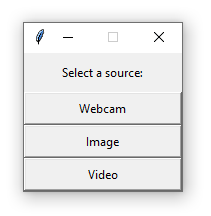

# OpenFader - A simple GUI for Face Recognition

## Overview

**OPENFADER** (which stands for OPEN source FAce Detection, Expression and
Recognition) is an interactive graphical user interface written in Python [https://www.python.org] that
allows user to perform three different algorithms, via webcam or by selecting a
source input, that are precisely Face Detection, Face Recognition and Facial
Expression (or Emotion) Recognition.

## Model

For the recognition problem, we used the face-recognition [https://pypi.org/project/facerecognition] library. For this
purpose (that is to compare features of the input face with those saved in our
database in order to obtain a match) this library uses an algorithm called **Face Landmarks Estimation**

## Graphical User Interface

The GUI is composed by two differente step:

1. Select the media source between Image, Video or Webcam. Below the GUI will appear.

2. The program starts automatically the GUI, designed as follow:

## Folder Structure and Usage

This library is structure as follow:
- **src**: it contains the source codes.
- **images**: it contains some images.
- **docs**: it contains the documentation to use OpenFader (the Poster).
- **media**: it contains the media to use the GUI. All media used with OpenFader will be stored in this folder.
Futhermore, in this folder there is a **main.py** file; it is an example of OpenFader usage.
To test it, you can simply download this folder, import all required packages and then run the main.py file.

## Requirements

To run the OpenFader library the following python packages are required:
- **tkinter**
- **PIL**
- **cv2** (opencv)
- **moviepy**
- **tensorflow**
- **face_recognition**
- **fer**
